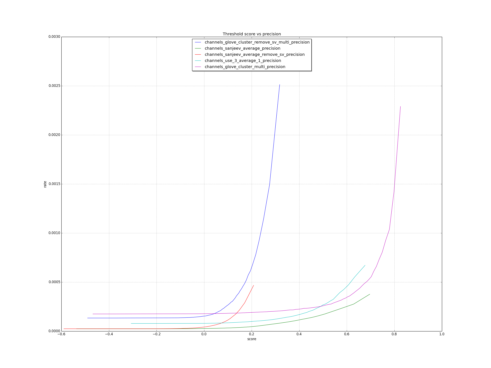

# roc
Roc charting tools

## Install

`pip install roc-tools`

requirements

`pip install matplotlib`
`pip install future`

On linux
`sudo apt-get install python-tk`

## Usage
`roc -h`

`roc inputfolder` or `roc inputfiles`

## Inputfile format
A CSV with four columns, defalut delimiter is `\x01`


`Input format: CSV by --delimiter: len(rocord)==4. Ex: modelId, weight, score, label`


## Exampe

We have a 1G cvs data.
```
> ls -lh data/000001_0.gz
-rw-r--r--  1 zf  staff   1.1G Mar 14 10:46 data/000001_0.gz
```

Using the default CSV delimiter, `\x01`
```
> gzcat data/000001_0.gz | head
channels_use_3_average_1\x011.0\x010.5278635621070862\x010
channels_use_3_average_1\x011.0\x010.28971177339553833\x010
channels_use_3_average_1\x011.0\x010.31590744853019714\x010
```

Let generate the ROC with 10% of data.
```
> roc --sample 0.1 data
```

```
Args: Namespace(aucSelect=False, bufferSize=32000, cutoff=False, delimiter='\x01', ignoreInvalid=False, inputDir='data', phrase=0, plotSizeRate=1.5, sample=0.1, selectLimit=0, shardCount=64, useMask='', verbose=False)
merging files by model to merges
Total line proccessed 12011651
merging files take 287.450480938s
sorting files....
sorted file sorts/channels_use_3_average_1.txt ready
sorting files take 53.800538063s
processing data....
processData data for channels_use_3_average_1
channels_use_3_average_1 AUC: 0.774804
channels_use_3_average_1 F1: 0.000157
channels_use_3_average_1 Observed/Expected Ratio: 0.000232
png:  results/pr_curve.png results/roc_curve.png results/corr_curve.png results/precision.png results/recall.png
```

Let take a look at the result image.





