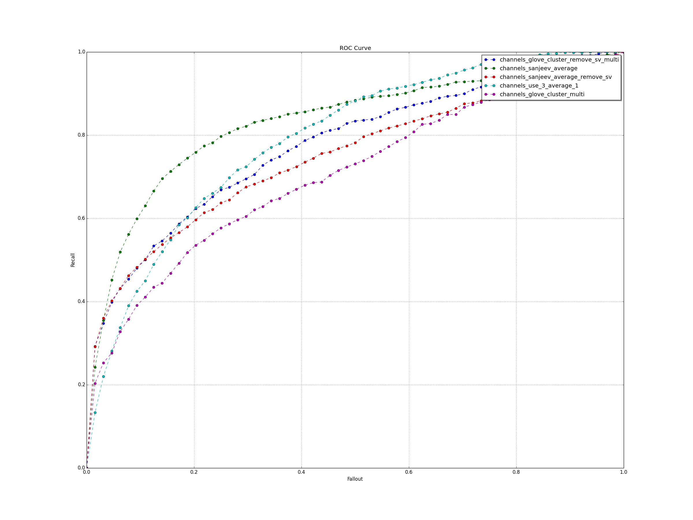

# Roc charting tools
Ploting ROC charts is not easy, which usually requires a MapReduce like data proccessing code.

This tools is highly optimized and run on single machine super fast.
In the brenchmarking, it processed 1.1G compressed GZ data within 300 seconds on a `3.1 GHz Intel Core i7 Macbook pro`.

## Install

`pip install roc-tools`

## Requirements

For ploting support
`pip install matplotlib`

For python2/3 compatiable
`pip install future`

On linux
`sudo apt-get install python-tk`

## Usage

`roc inputfolders` or `roc inputfiles...`

```
> roc -h
usage: roc [-h] [-p PHRASE] [-d DELIMITER] [-s SHARD_COUNT] [--sample SAMPLE]
           [-b BUFFER_SIZE] [-i] [-r PLOT_SIZE_RATE] [--mask USE_MASK]
           [--tmp TEMPDIR] [--auc_select] [--select_limit SELECT_LIMIT] [-v]
           [--print-cutoff] [--no-plot] [--output-dir OUTPUT_DIR]
           input_dirs [input_dirs ...]

positional arguments:
  input_dirs            Input format: CSV by --delimiter: len(rocord)==4. Ex:
                        modelId, weight, score, label

optional arguments:
  -h, --help            show this help message and exit
  -p PHRASE, --phrase PHRASE
                        Start phrase. 0 : Group, 1 : Sort, 2 : Process, 3 :
                        Chart
  -d DELIMITER, --delimiter DELIMITER
                        CSV field delimiter. Default is \x01
  -s SHARD_COUNT, --shard SHARD_COUNT
                        Shard count. Specify how many data point to generate
                        for plotting. default is 100
  --sample SAMPLE       Record sample rate. Specify how much percentage of
                        records to keep per model.
  -b BUFFER_SIZE, --buffer BUFFER_SIZE
                        buffer_size to use for sorting, default is 32000
  -i, --ignore_invalid  Ignore invalid in thread
  -r PLOT_SIZE_RATE, --rate PLOT_SIZE_RATE
                        Chart size rate. default 2
  --mask USE_MASK       mask certain data. Ex 'metric_nus*,metric_supply*'.
                        Will remove data collection label start with
                        'metric_nus and metric_supply'
  --tmp TEMPDIR         Tmp dir path
  --auc_select          Select top n=select_limit roc curve by roc AUC
  --select_limit SELECT_LIMIT
                        Select top n model
  -v, --verbose         Be verbose
  --print-cutoff        print cutoff
  --no-plot             do not plot
  --output-dir OUTPUT_DIR
                        output data file
```

## Inputfile format
A CSV with four columns, defalut delimiter is `\x01`


`Input format: CSV by --delimiter: len(rocord)==4. Ex: modelId, weight, score, label`


## Exampe

We have a 1G cvs data.
```
> ls -lh data/000001_0.gz
-rw-r--r--  1 zf  staff   1.1G Mar 14 10:46 data/000001_0.gz
```

Using the default CSV delimiter, `\x01`
```
> gzcat data/000001_0.gz | head
channels_use_3_average_1\x011.0\x010.5278635621070862\x010
channels_use_3_average_1\x011.0\x010.28971177339553833\x010
channels_use_3_average_1\x011.0\x010.31590744853019714\x010
```

Let generate the ROC with 10% of data.
```
> roc --sample 0.1 data
```

```
Args: Namespace(auc_select=False, buffer_size=32000, delimiter='\x01', ignore_invalid=False, input_dirs=['data'], no_plot=False, output_dir='results', phrase=0, plot_size_rate=2, print_cutoff=False, sample=0.1, select_limit=0, shard_count=100, tempdir='/tmp/', use_mask='', verbose=False)
merging files by model to merges
Total line proccessed 12011651
merging files take 287.450480938s
sorting files....
sorted file sorts/channels_use_3_average_1.txt ready
sorting files take 53.800538063s
processing data....
processData data for channels_use_3_average_1
channels_use_3_average_1 AUC: 0.774804
channels_use_3_average_1 F1: 0.000157
channels_use_3_average_1 Observed/Expected Ratio: 0.000232
png:  results/pr_curve.png results/roc_curve.png results/corr_curve.png results/precision.png results/recall.png
```

Let take a look at the result image.




## Resume from failure from phrase checkpoint

The roc command breakdown the process to 4 phrases.
0. Merge data, group and merge records by model
1. Sort data, sort records by model
2. Proccess, computing roc data
3. Plot, ploting the charts

If your command failed at certain phrase, you can restart it and change the arguments.

For example, if you sort filed, because of limit of file descriptor (See FAQ #1)
You can resume the job with the below command and add argument to change the buffer.
```
roc <your-data> -p 1 --buffer 64000
```

Also you can use the phrase argument to re-chart with different scale ratio.

```
roc <your-data> -p 3 -r 2.0
```

## Use it as a Python lib

E.g
```
    from roc_tools.roc import ROC
    roc = ROC(
        input_dirs = ...,
        sample = 0.3,
        buffer_size = 64000,
        tempdir = '/mnt/tmp/'
        print_cutoff = True,
        output_dir = ...,
    )
```

Parameters of ROC class is same as the CLI params.

## FAQ

1. ```IOError: [Errno 24] Too many open files: '/tmp/```

If you run it on a very large data, you may run into this issue. It's becaused the external merge sort create too many tmp file during the soring phrase.

Two ways to solve it.

First, turn up the file descriptor limit in your system, the default is usually 256.
You can change it with `> ulimit -n 10000`

Sencod way to solve it.
Make the merge sort buffer bigger, which will lead to less parallism thus less tmp files created.
for example `--buffer 128000`
 


